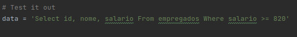
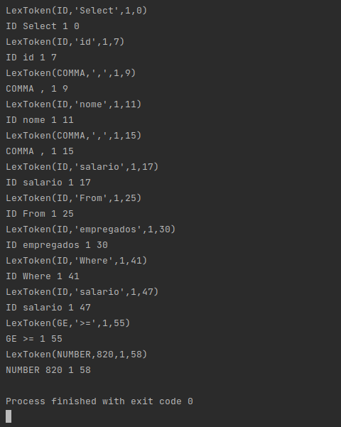

# TPC4: Analisador Léxico

Construir um analisador léxico para uma liguagem de query com a qual se podem escrever frases do género:

    Select id, nome, salario From empregados Where salario >= 820

**Resultados**

Exemplo:

Resultado:

